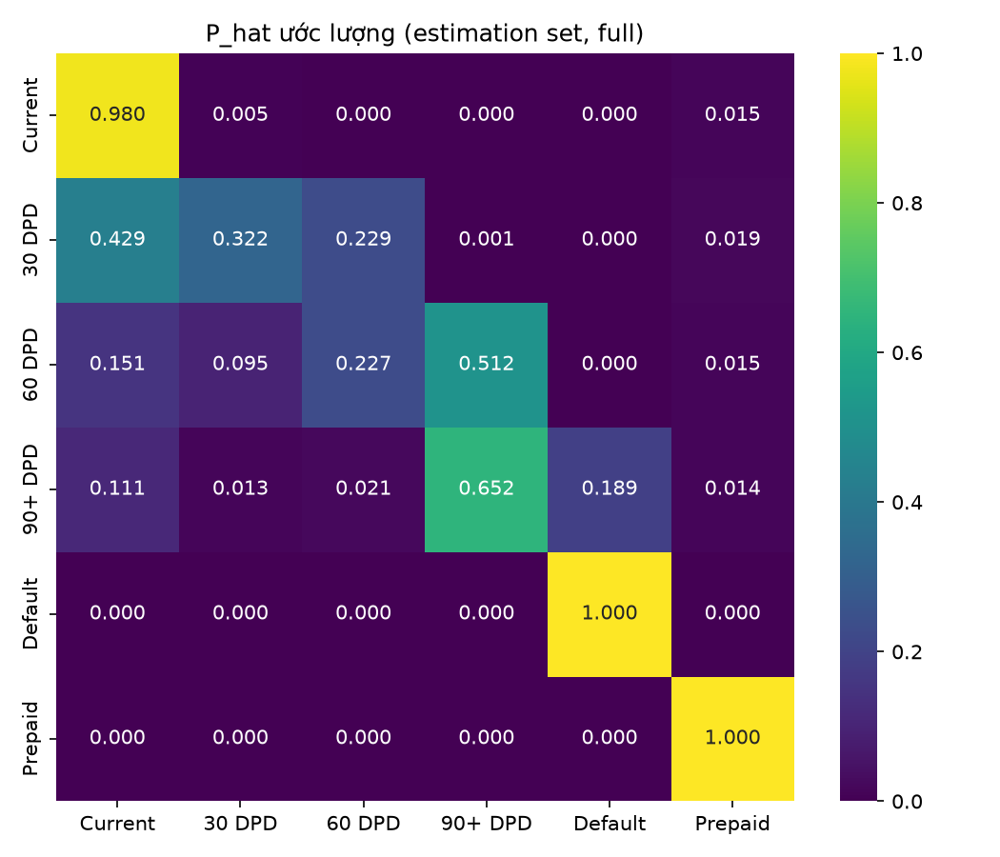
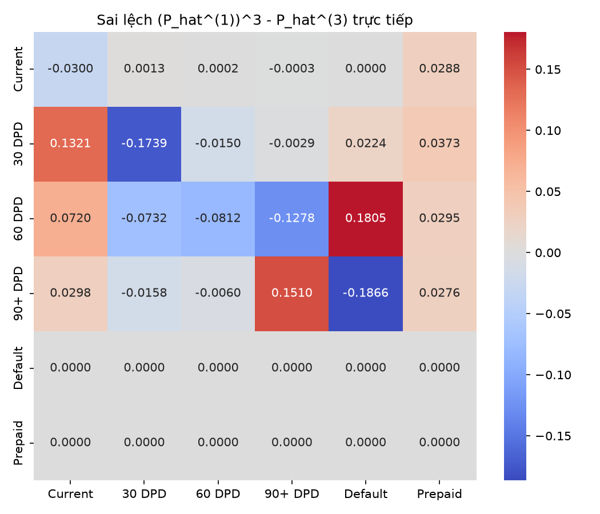
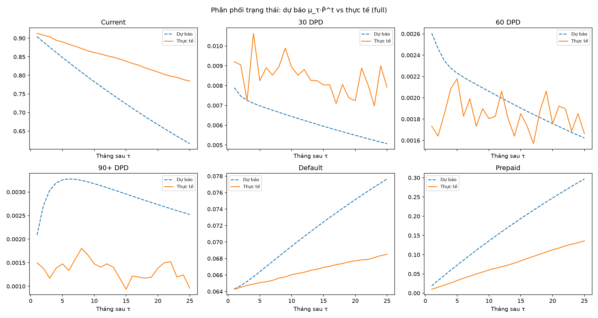
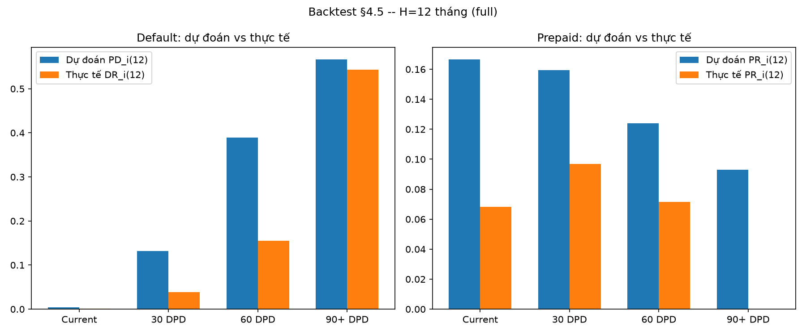

# CHƯƠNG 4: KẾT QUẢ THỰC NGHIỆM

> **[Đã chạy Phase 2-4 — 2026-09-23]** Toàn bộ §4.1-§4.5 đã có số liệu thật (estimation set 150.000 khoản vay, τ=02/2024, validation set 25 tháng). Nguồn: `scripts/03_estimate_transition_matrix.ipynb`, `scripts/04_hypothesis_tests.ipynb`, `scripts/05_stationary_and_absorption.ipynb` (cả ba FROZEN).

## 4.1. Ước lượng ma trận chuyển trạng thái

**Cỡ mẫu:** estimation set 7.253.423 dòng, 150.000 khoản vay; 7.103.422/7.253.423 cặp $(S_t,S_{t+1})$ hợp lệ (số chênh lệch là các dòng cuối segment, không có $t+1$ để ghép cặp).

**Bảng số quan sát mỗi trạng thái $n_{i\cdot}$:**

| Trạng thái | $n_{i\cdot}$ | % |
|---|---|---|
| Current | 6.875.554 | 96,79% |
| 30 DPD | 54.505 | 0,77% |
| 60 DPD | 16.903 | 0,24% |
| 90+ DPD | 24.906 | 0,35% |
| Default | 131.554 | 1,85% |
| Prepaid | 0 | 0% |

Hàng Prepaid có $n_{i\cdot}=0$ — không phải thiếu dữ liệu, mà vì sự kiện Prepaid (`zero_balance_code=01`) thường là bản ghi **cuối cùng** của khoản vay trong dữ liệu Freddie Mac (ngừng báo cáo sau khi trả hết nợ), nên không tồn tại tháng $t+1$ để ghép cặp. Hàng này trong $\hat{P}$ được ép cứng thành vector đơn vị theo đúng dạng chuẩn ma trận hấp thụ (2.6), không dùng dữ liệu thực nghiệm.

**Ma trận $\hat{P}$ (làm tròn 4 chữ số):**

| Từ \ Đến | Current | 30 DPD | 60 DPD | 90+ DPD | Default | Prepaid |
|---|---|---|---|---|---|---|
| Current | 0,9798 | 0,0051 | 0,0000 | 0,0000 | 0,0000 | 0,0150 |
| 30 DPD | 0,4293 | 0,3220 | 0,2289 | 0,0008 | 0,0001 | 0,0190 |
| 60 DPD | 0,1505 | 0,0950 | 0,2266 | 0,5120 | 0,0005 | 0,0154 |
| 90+ DPD | 0,1109 | 0,0128 | 0,0214 | 0,6517 | 0,1888 | 0,0144 |
| Default | 0 | 0 | 0 | 0 | 1 | 0 |
| Prepaid | 0 | 0 | 0 | 0 | 0 | 1 |

**Diễn giải:**
- Xác suất ở lại Current rất cao (0,98) — phần lớn danh mục ổn định.
- Roll-forward tăng dần theo mức quá hạn: 90+DPD → Default = 0,6517 là roll-forward mạnh nhất trong bảng, phản ánh 90+DPD là ngưỡng gần Default nhất trong 4 trạng thái tạm thời.
- **Cure (roll ngược) đáng kể**, không phải hiện tượng hiếm: từ 60DPD có 0,15 quay lại 30DPD; từ 90+DPD có 0,111 về thẳng Current và 0,013+0,021 về 30DPD/60DPD — khớp quan sát thực tế trong `data/raw/DATA_DICTIONARY.md` (kịch bản cure do forbearance/thiên tai).
- Độ tin cậy các hàng: Current/Default có $n_{i\cdot}$ lớn (hàng triệu/hàng trăm nghìn) nên ước lượng ổn định; 60DPD/90+DPD có $n_{i\cdot}$ nhỏ hơn nhiều (16.903/24.906) nên các ô hiếm trong 2 hàng này (ví dụ 60DPD→Default=0,0005) có sai số ước lượng lớn hơn tương đối.

## 4.2. Kết quả kiểm định giả thiết mô hình

Chia estimation set thành 9 giai đoạn con theo năm dương lịch (2016-2024, gắn nhãn theo tháng $t+1$ — tháng xảy ra chuyển, mục 3.2.2), mỗi năm đều đủ quan sát nên không cần gộp giai đoạn nào (năm ít nhất — 2024 — vẫn có 80.133 quan sát ở 4 trạng thái tạm thời).

### 4.2.1. Kiểm định tính thuần nhất theo thời gian

**H0: ma trận chuyển trạng thái không đổi theo thời gian.**

**Kiểm định tổng thể (Anderson-Goodman LR, công thức mục 2.6):**

| Thống kê | Giá trị |
|---|---|
| $\chi^2_{\text{TN}}$ | 69.101,63 |
| Bậc tự do | 160 |
| p-value | $\approx 0$ |
| Kết luận | **Bác bỏ $H_0$** |

**Từng cặp giai đoạn liền kề (hiệu chỉnh Bonferroni, $\alpha=0{,}05/9=0{,}005556$):**

| Cặp | Statistic | df | p-value | Bác bỏ $H_0$? |
|---|---|---|---|---|
| 2016 vs 2017 | 115,66 | 17 | $1{,}03\times10^{-16}$ | Có |
| 2017 vs 2018 | 211,54 | 19 | $1{,}70\times10^{-34}$ | Có |
| 2018 vs 2019 | 4.282,29 | 19 | $\approx0$ | Có |
| **2019 vs 2020** | **19.344,72** | 20 | $\approx0$ | Có |
| 2020 vs 2021 | 2.969,72 | 20 | $\approx0$ | Có |
| 2021 vs 2022 | 6.469,45 | 20 | $\approx0$ | Có |
| 2022 vs 2023 | 1.348,13 | 20 | $1{,}45\times10^{-273}$ | Có |
| 2023 vs 2024 | 26,26 | 19 | 0,123 | Không |
| pre-2020 vs 2020+ | 35.627,60 | 20 | $\approx0$ | Có |

**Kết luận:** bác bỏ $H_0$ ở cả kiểm định tổng thể lẫn 8/9 cặp giai đoạn liền kề — ma trận chuyển trạng thái **không** thuần nhất theo thời gian. Cặp 2019-2020 có statistic lớn vượt trội (19.344,72, gấp ~6 lần cặp liền kề gần nhất) — khớp giả thuyết các chương trình hỗ trợ người vay giai đoạn COVID-19 (forbearance, payment deferral — xem `data/raw/DATA_DICTIONARY.md`) làm thay đổi đáng kể hành vi chuyển trạng thái trong giai đoạn 2020-2022. Chỉ cặp 2023-2024 (giai đoạn gần cuối estimation set, sát mốc $\tau$) không bác bỏ.

**Lưu ý về diễn giải:** với cỡ mẫu estimation set lên tới hàng triệu quan sát, thống kê $\chi^2$ rất nhạy — ngay cả sai lệch nhỏ về mặt thực chất cũng đủ để bác bỏ $H_0$ về mặt thống kê ở mức ý nghĩa thông thường. Vì vậy nên đọc kết quả theo **độ lớn tương đối của statistic giữa các giai đoạn** (ví dụ 2019-2020 vs 2023-2024) hơn là chỉ theo nhãn bác bỏ/không bác bỏ nhị phân.

Bảng đầy đủ: `outputs/tables/chi2_homogeneity.csv`.

### 4.2.2. Kiểm định bậc Markov

**H0: bậc 1 là đủ (xác suất chuyển chỉ phụ thuộc trạng thái hiện tại, không phụ thuộc trạng thái 1 bước trước đó).**

| Thống kê | Giá trị |
|---|---|
| LR statistic | 36.899,997 |
| Bậc tự do | 54 |
| p-value | $\approx 0$ |
| Kết luận | **Bác bỏ $H_0$** |

**Kết luận:** bác bỏ $H_0$ — mô hình Markov bậc 1 không đủ để mô tả đầy đủ động lực chuyển trạng thái; xác suất chuyển thực tế còn phụ thuộc vào trạng thái 2 bước trước đó (hoặc, diễn giải tương đương, phụ thuộc thời gian đã lưu lại ở trạng thái hiện tại — duration dependence). Kết quả này **nhất quán** với sai lệch quan sát được ở kiểm chứng Chapman-Kolmogorov (mục 4.3): chuẩn Frobenius 0,42 không giảm đáng kể dù cỡ mẫu tăng ~60 lần so với bản smoke — cả hai cùng chỉ về cùng một nguyên nhân, không phải nhiễu ngẫu nhiên độc lập.

Bảng đầy đủ: `outputs/tables/lr_test_order.csv`.

## 4.3. Kiểm chứng Chapman–Kolmogorov bằng số

So $(\hat{P}^{(1)})^3$ (lũy thừa ma trận, công thức (2.12)) với $\hat{P}^{(3)}_{\text{trực tiếp}}$ (ước lượng trực tiếp từ 6.803.851 cặp $(S_t,S_{t+3})$ trong cùng segment):

| Chỉ số | Giá trị |
|---|---|
| Chuẩn Frobenius $\lVert (\hat{P}^{(1)})^3 - \hat{P}^{(3)}_{\text{trực tiếp}} \rVert_F$ | 0,421953 |
| Sai lệch tuyệt đối lớn nhất từng ô | 0,186636 |

**Diễn giải:** sai lệch ở mức trung bình (2 trạng thái hấp thụ luôn khớp tuyệt đối; sai lệch chỉ đến từ 4 hàng tạm thời, trần lý thuyết $\sqrt{4\times2}\approx2{,}83$ nên 0,42 tương đương ~15% mức lệch tối đa). Điểm đáng chú ý: chuẩn Frobenius trên bản smoke (2.000 khoản vay) là 0,465 — gần như không giảm dù cỡ mẫu ở full run lớn hơn ~60 lần. Nếu sai lệch chỉ do nhiễu ngẫu nhiên (sampling noise), lẽ ra phải giảm mạnh theo $N$; việc không giảm là tín hiệu cho thấy đây có thể là **sai lệch mang tính hệ thống** — ví dụ xác suất chuyển phụ thuộc thời gian đã ở trạng thái (duration dependence), không chỉ trạng thái hiện tại, vi phạm giả định Markov bậc 1. Đây chính là câu hỏi mà kiểm định bậc Markov (LR test, mục 4.2.2) sẽ trả lời chính thức bằng accept/reject $H_0$.

## 4.4. Phân phối dừng: lý thuyết so với thực nghiệm

**Phân phối dừng lý thuyết:** giải $\pi\hat{P}=\pi$ trên toàn bộ $\hat{P}$ (6 trạng thái) cho $\pi = (0,0,0,0,0.5,0.5)$ — đúng như dự đoán lý thuyết (mục 2.4.2): xích có 2 trạng thái hấp thụ nên nghiệm **suy biến**, dồn toàn bộ khối lượng vào Default/Prepaid (điểm cụ thể 50/50 do `lstsq` chọn nghiệm chuẩn nhỏ nhất, không mang ý nghĩa thực chất). Kết quả này **không** dùng để so sánh trực tiếp với thực nghiệm.

**So sánh có ý nghĩa: dự báo hữu hạn kỳ $\mu_\tau\cdot\hat{P}^t$ vs thực tế.** Lấy $\mu_\tau$ = phân phối trạng thái thực tế tại $\tau$ (42.677 khoản vay đang được theo dõi), dự báo tiến $t=1..25$ tháng, so với trạng thái thực tế của **đúng cùng cohort 42.677 khoản đó** tại mỗi tháng $\tau+t$ (dùng forward-fill trạng thái cuối cùng đã biết cho khoản ngừng báo cáo, nhất quán với sticky-absorbing — không dùng % trên tập khoản còn báo cáo mỗi tháng, vì mẫu số đó co dần và không khớp mẫu số cố định của dự báo).

| $t$ (tháng) | Current: dự báo/thực tế | Default: dự báo/thực tế | Prepaid: dự báo/thực tế |
|---|---|---|---|
| 1 | 90,43% / 91,31% | 6,43% / 6,43% | 1,89% / 1,01% |
| 5 | 84,82% / 89,02% | 6,64% / 6,51% | 7,29% / 3,28% |
| 10 | 78,31% / 86,15% | 6,95% / 6,60% | 13,58% / 6,02% |
| 15 | 72,30% / 83,83% | 7,24% / 6,69% | 19,38% / 8,40% |
| 20 | 66,75% / 80,91% | 7,51% / 6,77% | 24,74% / 11,28% |
| 25 | 61,62% / 78,48% | 7,77% / 6,85% | 29,69% / 13,61% |

Bảng đầy đủ (6 trạng thái): `outputs/tables/forecast_vs_actual_distribution.csv`.

**Diễn giải:**
- **Bậc thang quá hạn (30/60/90+DPD, không hiện trong bảng trên) và Default: khớp thực tế khá tốt suốt 25 tháng** — Default lệch dưới 1 điểm % trong toàn bộ giai đoạn, tăng rất chậm từ 0 (t=1) lên 0,92 điểm % (t=25).
- **Current và Prepaid lệch lớn và gần như đối xứng nhau:** ở $t=25$, Current lệch $-16{,}86$ điểm % (dự báo thấp hơn), Prepaid lệch $+16{,}08$ điểm % (dự báo cao hơn) — tổng gần triệt tiêu, cho thấy đây là **một hiện tượng duy nhất**: mô hình dự báo tốc độ trả trước hạn nhanh hơn thực tế khoảng 2 lần.
- **Nguyên nhân:** $\hat{P}$ ước lượng gộp trên toàn estimation set (2016-2024), bao gồm giai đoạn lãi suất thấp 2020-2021 (làn sóng refinance), áp dụng dự báo cho giai đoạn validation 2024-2026 (lãi suất cao hơn, ít động lực trả trước hạn) — khớp trực tiếp với kết quả bác bỏ tính thuần nhất theo thời gian ở mục 4.2.1.

## 4.5. Ma trận cơ bản, xác suất vỡ nợ và backtest trên tập kiểm định

**Ma trận cơ bản $\hat{N}$ và xác suất hấp thụ trọn đời $\hat{B}$:**

| Từ | $E[\text{số tháng đến hấp thụ}]$ | $B$: Default | $B$: Prepaid |
|---|---|---|---|
| Current | 62,50 (kỳ vọng tổng số tháng qua các state trước hấp thụ) | 0,0441 | 0,9559 |
| 30 DPD | — | 0,1704 | 0,8296 |
| 60 DPD | — | 0,4196 | 0,5804 |
| 90+ DPD | — | 0,5883 | 0,4117 |

**$\mathrm{PD}_i(H{=}12)$ (Phương án A đã chốt, công thức (2.19)):**

| $i$ | $\mathrm{PD}_i(12)$ dự đoán | $\mathrm{Prepaid}_i(12)$ dự đoán |
|---|---|---|
| Current | 0,41% | 16,64% |
| 30 DPD | 13,18% | 15,96% |
| 60 DPD | 38,89% | 12,40% |
| 90+ DPD | 56,62% | 9,31% |

**Backtest bắt buộc — so với tỷ lệ thực tế quan sát trên validation set (cohort tại $\tau$, $H=12$ tháng):**

| $i$ | $m_i$ | $\mathrm{PD}_i(12)$ dự đoán | $\mathrm{DR}_i(12)$ thực tế [CI 95%] | Chênh lệch | $\mathrm{Prepaid}_i(12)$ dự đoán | $\mathrm{PR}_i(12)$ thực tế [CI 95%] | Chênh lệch |
|---|---|---|---|---|---|---|---|
| Current | 39.195 | 0,41% | 0,09% [0,06–0,12%] | +0,33pp | 16,64% | 6,84% [6,59–7,09%] | +9,81pp |
| 30 DPD | 392 | 13,18% | 3,83% [2,33–6,22%] | +9,35pp | 15,96% | 9,69% [7,14–13,03%] | +6,26pp |
| 60 DPD | 84 | 38,89% | 15,48% [9,27–24,70%] | +23,42pp | 12,40% | 7,14% [3,31–14,72%] | +5,26pp |
| 90+ DPD | 70 | 56,62% | 54,29% [42,70–65,43%] | **+2,33pp** | 9,31% | 0,00% [0–5,20%] | +9,31pp |

*(CI Wilson 95% cho tỷ lệ quan sát thực nghiệm $\mathrm{DR}_i$/$\mathrm{PR}_i$ — không phải bootstrap CI cho $\hat{B}$/$\pi$, xem `PROJECT_BRIEF.md` mục 6.)*

Bảng đầy đủ: `outputs/tables/backtest_4_5.csv`.

**Diễn giải:**
- **Default:** mô hình dự đoán cao hơn thực tế ở mọi trạng thái (đúng hướng, nhất quán), nhưng độ lệch **không đơn điệu** theo mức độ quá hạn — tệ nhất ở 60DPD (dự đoán cao gấp 2,5 lần thực tế). Đối chiếu giá trị dự đoán với CI của thực tế: dự đoán nằm **ngoài** CI ở Current/30DPD/60DPD (lệch có ý nghĩa thống kê), nhưng ở **90+DPD — trạng thái quan trọng nhất cho cảnh báo sớm — dự đoán 56,62% nằm TRONG CI thực tế [42,70%-65,43%]**, không phân biệt được về mặt thống kê (lưu ý $m_i=70$ khá nhỏ nên CI khá rộng).
- **Prepaid:** mô hình dự đoán cao hơn thực tế ở mọi trạng thái, cực đoan nhất ở 90+DPD (dự đoán 9,31% nhưng 0/70 khoản thực tế trả trước hạn) — hợp lý về kinh tế (khoản quá hạn nặng hiếm khi đủ điều kiện refinance).
- **Liên hệ mục 4.2:** cả 2 sai lệch hệ thống (Default bị phóng đại ở state nhẹ, Prepaid bị phóng đại ở mọi state) đều nhất quán với việc $H_0$ về tính thuần nhất theo thời gian bị bác bỏ — $\hat{P}$ ước lượng trên toàn giai đoạn 2016-2024 không đại diện tốt cho hành vi thực tế ngay sau $\tau$ (02/2024).
- **Kết luận:** mô hình có xu hướng phóng đại rủi ro (cả vỡ nợ lẫn trả trước hạn) cho phần lớn danh mục, nhưng vẫn cho dự báo Default đáng tin cậy nhất đúng ở nhóm khoản vay cần cảnh báo sớm nhất (90+DPD) — có giá trị thực tiễn dù còn hạn chế.
